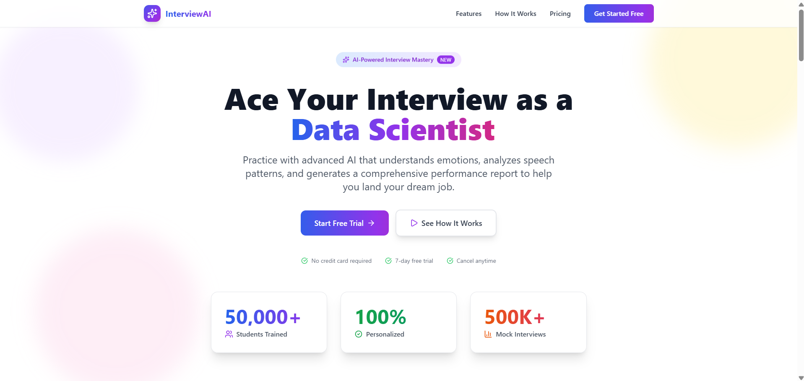
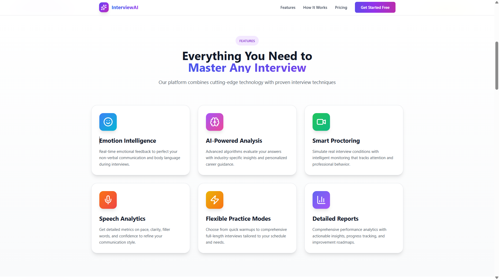
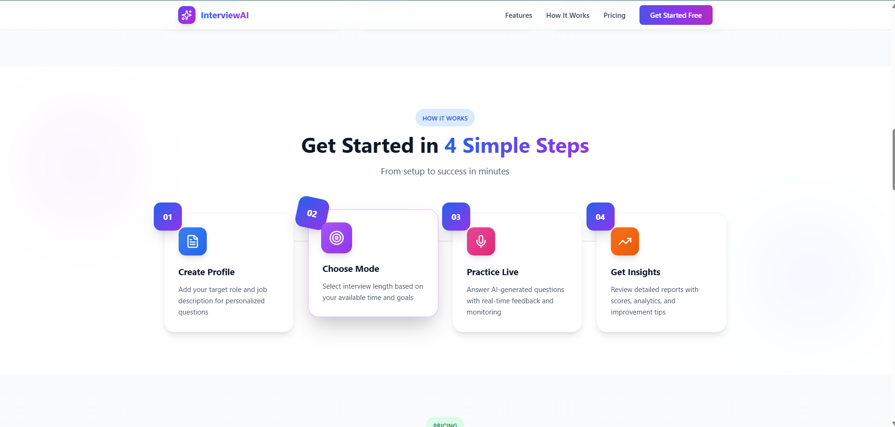
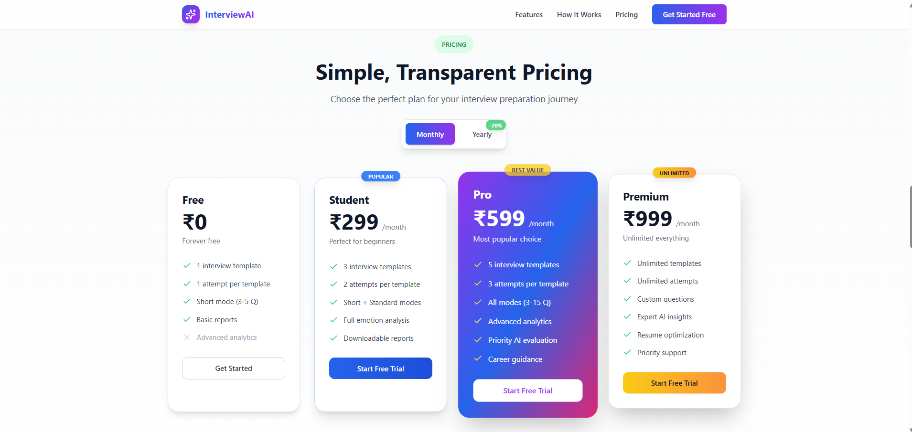
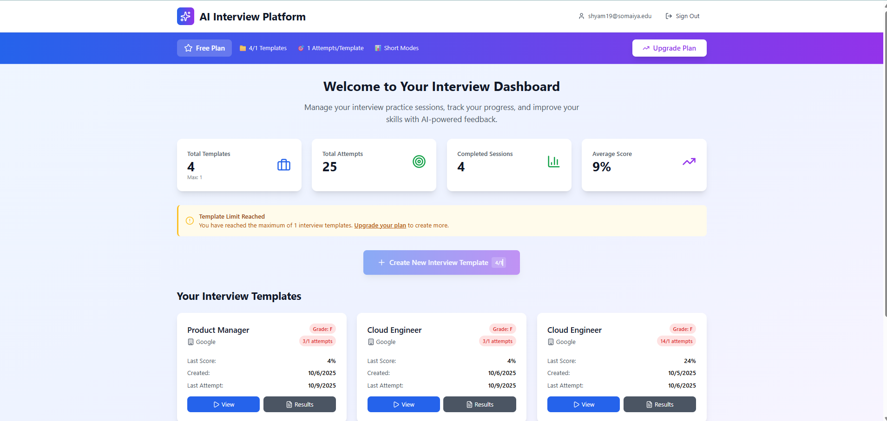
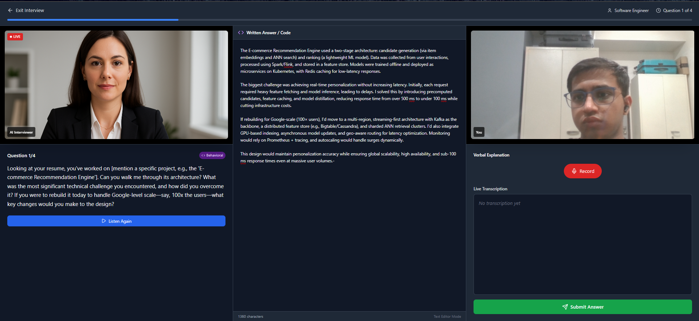
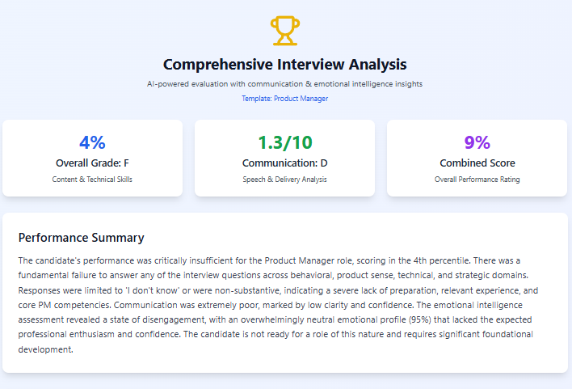
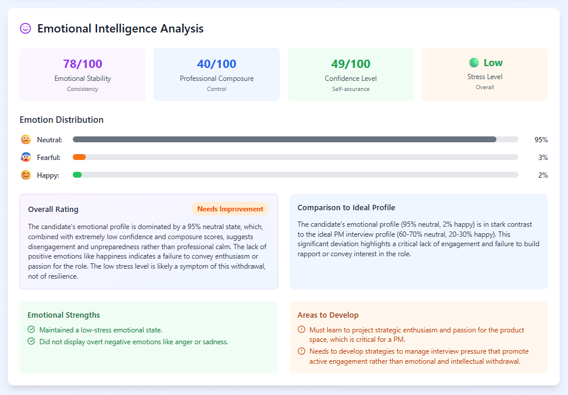
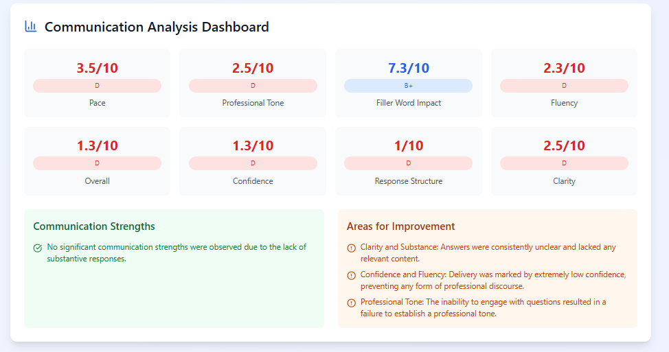
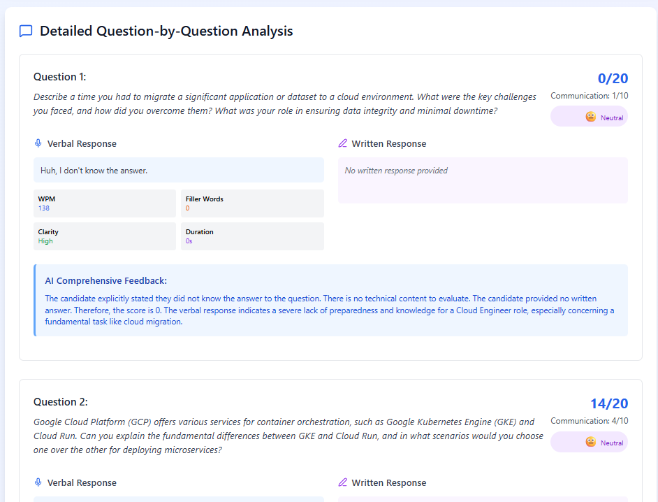

# AI Interview Platform

## Practice Real Interviews with AI
Experience the future of interview preparation with our cutting-edge platform that offers real-time emotion detection, smart proctoring, speech analytics, and personalized reports powered by Gemini and Firebase.

<p align="left">
  
  
  
  
  
  
  
</p>

## Highlights
- **7-Emotion Detection**: Analyze emotions with confidence and history (happy, sad, angry, surprised, fearful, neutral, disgusted).
- **Smart Proctoring**: Ensure integrity with face presence, multi-face detection, head pose tracking, eye closure monitoring, and tab switch detection.
- **Dual Speech-to-Text**: Utilize browser speech recognition alongside Google Cloud Speech-to-Text; enjoy TTS auto-play for questions.
- **Template System**: Customize your experience with attempt limits, resume support, and mode selection (3–15 questions).
- **Async AI Evaluation**: Receive comprehensive results with emotional intelligence insights based on content and communication.
- **Razorpay Subscriptions**: Choose from Free, Student, Pro, or Premium plans with secure verification and plan gating.

## Tech Stack
- **Frontend**: React, Vite, Zustand, Tailwind, Lucide Icons
- **Backend**: Firebase Auth, Firestore, Storage, Cloud Functions (Gen2)
- **AI Technologies**: Google Generative AI (Gemini 2.5 Flash-Lite), Cloud STT/TTS
- **Media Processing**: MediaPipe Tasks (Face Landmarker)
- **Payment Processing**: Razorpay


## Screenshots

### Landing Page Sections

#### Hero Section
<p align="center">
  
  <br>
  <em>Hero section with main headline, typing animation, and call-to-action buttons</em>
</p>

#### Features Section
<p align="center">
  
  <br>
  <em>Features section highlighting key platform capabilities</em>
</p>

#### How It Works Section
<p align="center">
  
  <br>
  <em>Step-by-step guide on how to use the platform</em>
</p>

#### Pricing Section
<p align="center">
  
  <br>
  <em>Pricing plans with monthly/yearly toggle</em>
</p>

### Dashboard
<p align="center">
  
  <br>
  <em>Main dashboard showing interview templates and recent sessions</em>
</p>

### Interview Session
<p align="center">
  
  <br>
  <em>Real-time interview session with emotion detection and proctoring overlay</em>
</p>

### Report Overview
<p align="center">
  
  <br>
  <em>Comprehensive interview report with overall scores and summary</em>
</p>

### Emotion Analysis
<p align="center">
  
  <br>
  <em>Detailed emotion analysis with charts and confidence scores</em>
</p>

### Communication Analysis
<p align="center">
  
  <br>
  <em>Speech analytics showing WPM, fillers, pauses, and fluency metrics</em>
</p>

### Per Question Results
<p align="center">
  
  <br>
  <em>Detailed breakdown of scores and feedback for each interview question</em>
</p>

## Key Features

### Real-time Emotions

- **7 Emotions with Confidence**: Detect emotions with 2-second updates and per-question summaries.
- **Visual Cues**: Overlay with emojis, color cues, and thresholding for immediate feedback.

### Smart Proctoring

- **Comprehensive Monitoring**: Detect no-face, multi-face, head-turn (yaw/pitch), eye-closure, and tab-switch events.
- **Event Logging**: Implement cooldowns, sustained-turn checks, and maintain an event log for integrity.

### Speech In/Out

- **Dual Speech Recognition**: Utilize browser STT and Google Cloud STT with metrics for WPM, fillers, pauses, clarity, and fluency.
- **Text-to-Speech**: Google TTS for questions with auto-play and retry safety features.

### Interview Flow

- **Customizable Templates**: Track attempts, resume sessions, and choose from 3 modes (short, standard, comprehensive).
- **Live Transcription**: Capture verbal and written/code responses in real-time.

### AI Evaluation

- **Async Scoring**: Gemini-based scoring system (0–20 per question) along with communication metrics (0–10).
- **Comprehensive Reports**: Receive insights on strengths, areas for improvement, study plans, and career guidance.

### Emotion Intelligence

- **Stability Metrics**: Measure entropy-based stability, professional composure, confidence, and stress levels.
- **Emotion Distribution**: Analyze distribution versus ideal profile and per-question emotion states.

### Subscriptions and Payments

- **Razorpay Integration**: Seamless checkout, signature verification, and plan activation in Firestore.
- **Plan-Gated Limits**: Control access to templates, attempts, modes, and advanced reports based on subscription plans.

### Stack and Ops

- **Technology Stack**: Built with React, Vite, Zustand, and Firebase (Auth/Firestore/Storage/Functions Gen2).
- **State Management**: Ensure clean state persistence, secure storage URLs, and Firestore rules ready for deployment.

## Quick Start

### Prerequisites
- Node.js 22+
- Firebase CLI (`npm install -g firebase-tools`)
- Google Cloud Platform account with enabled APIs (Speech-to-Text, Text-to-Speech, Generative AI)
- Razorpay account for payments

### 1) Clone and Install
```bash
git clone https://github.com/your-org/ai-interview-platform.git
cd ai-interview-platform

# Frontend
cd frontend
npm install

# Functions
cd ../functions
npm install
```

### 2) Environment Setup
Create `.env` file in the `functions` directory:
```env
GEMINI_API_KEY=your_gemini_api_key
RAZORPAY_KEY_ID=your_razorpay_key_id
RAZORPAY_KEY_SECRET=your_razorpay_key_secret
```

### 3) Firebase Configuration
```bash
# Login to Firebase
firebase login

# Initialize project (if not already done)
firebase init

# Deploy functions
firebase deploy --only functions

# Deploy hosting
npm run build-and-deploy
```

### 4) Development
```bash
# Start frontend development server
cd frontend
npm run dev

# Start Firebase emulators
firebase emulators:start
```

## Project Structure
```
ai-interview-platform/
├── frontend/                 # React frontend
│   ├── src/
│   │   ├── components/       # Reusable components
│   │   │   ├── interview/    # Interview-specific components
│   │   │   └── payment/      # Payment components
│   │   ├── pages/            # Page components
│   │   └── store/            # Zustand state management
│   ├── public/               # Static assets
│   └── package.json
├── functions/                # Firebase Cloud Functions
│   ├── index.js              # Main functions file
│   └── package.json
├── firebase.json             # Firebase configuration
├── firestore.rules           # Firestore security rules
├── storage.rules             # Storage security rules
├── build-and-deploy.js       # Build and deployment script
├── screenshots/              # Project screenshots (add these images)
│   ├── landing-page.png      # Landing page with features overview
│   ├── dashboard.png         # Main user dashboard
│   ├── interview-session.png # Active interview session
│   ├── report-overview.png   # Interview report summary
│   ├── emotion-analysis.png  # Detailed emotion analysis
│   ├── communication-analysis.png # Speech and communication metrics
│   └── per-question-results.png # Individual question results
└── README.md
```

## API Endpoints

### Cloud Functions
- `processApplication` - Generate interview questions using Gemini AI
- `createInterviewSession` - Create new interview session
- `speechToTextAdvanced` - Advanced speech-to-text with analysis
- `evaluateAnswerAsync` - Asynchronous answer evaluation
- `generateReport` - Generate comprehensive interview report
- `createRazorpayOrder` - Create payment order
- `verifyRazorpayPayment` - Verify payment completion
- `textToSpeech` - Convert text to speech for questions

## Contributing
1. Fork the repository
2. Create a feature branch
3. Make your changes
4. Test thoroughly
5. Submit a pull request

## License
MIT License - see LICENSE file for details
